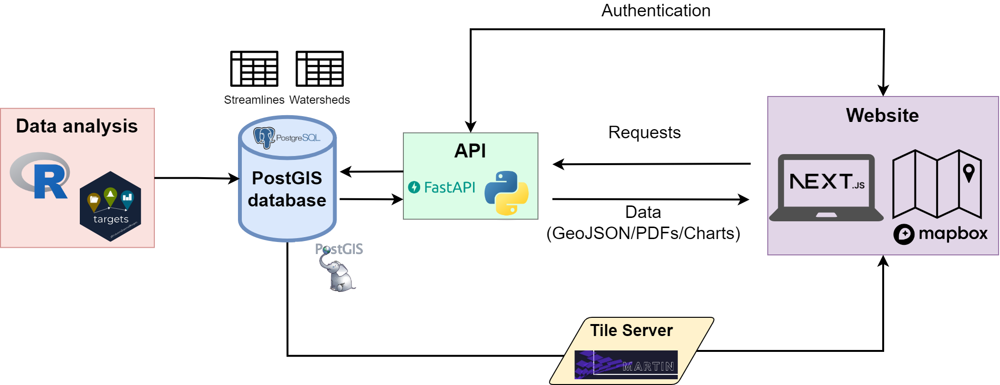
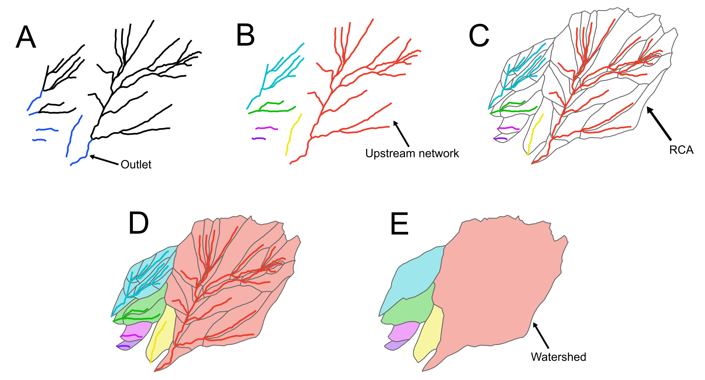
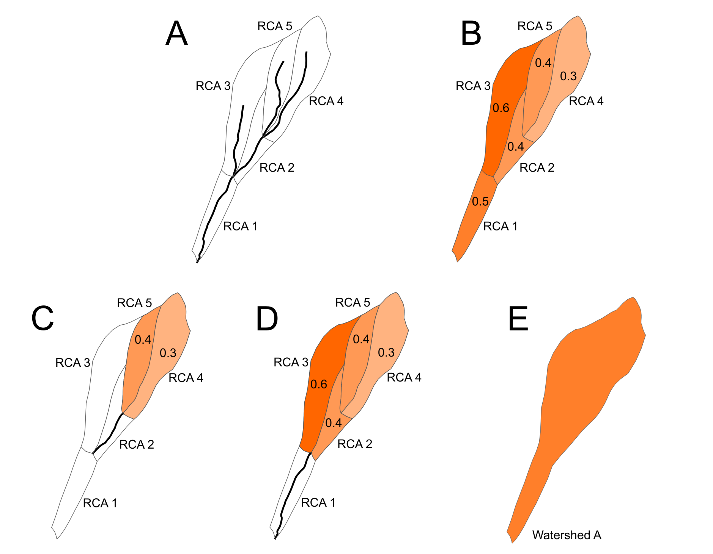

```{=html}
<style type="text/css">

body{ /* Normal  */
      font-size: 13px;
  }
td {  /* Table  */
  font-size: 13px;
}
h1.title {
  font-size: 24px;
  color: Black;
}
h1 { /* Header 1 */
  font-size: 19px;
  color: Black;
}
h2 { /* Header 2 */
    font-size: 15px;
  color: Black;
}
h3 { /* Header 3 */
    font-size: 15px;
  color: Black;
}
</style>
```


# Workflow and data pipeline
To create a robust, efficient and reproducible workflow which handled data analysis, data storage, and data visualisation, we created a pipeline that handled all these components  during the development of the Nootka Sound Salmon and Watershed Assessment Tool (Fig. 1).

The pipeline starts with the data acquisition and analysis steps using the R statistical programming language [@R]. For managing data science workflows, the *targets* R package was used [@targets]. This combination allowed for handling complex, reproducible workflows efficiently, where data was processed, transformed, and analyzed systematically. The *targets* package is particularly useful for ensuring that the analysis is consistent and can easily be re-run when new input data becomes available or analytical methods are updated. In addition, the sf package was used for handling and analyzing spatial data [@sf], while the *tidyverse* collection of R packages facilitated data manipulation and visualization [@tidyverse]. For database interactions, RPostgres was employed to interface with the PostgreSQL database [@rpostgres].

Once the data analysis was complete, the processed data were stored in a PostgreSQL database [@postgresql], extended with PostGIS to add support for geographic objects [@postgis]. The database serves as a central location for storage of all data and provides a performant way to extract data and display it on the front end website. To facilitate interaction between the database and other components, an application programming interface (API) was developed using FastAPI, a modern and high-performance web framework for building APIs with Python [@fastapi]. This API acts as an intermediary, handling requests and responses to and from the database, and ensuring that the data stored in the PostGIS-enabled PostgreSQL database is accessible to other parts of the pipeline in a secure and efficient manner.

For serving map tiles, which are essential for rendering large and complex spatial layers, a tile server called Martin was used [@martin]. The tile server provides pre-rendered map tiles, significantly enhancing the performance and user experience of the web application by allowing for fast and smooth map loading.

The front-end of the application was built using Next.js, a React-based framework that supported server-side rendering and static site generation [@nextjs]. This framework allows for building a highly responsive and dynamic web application. Mapbox [@mapbox] was used within the front end application for mapping and geospatial data visualization.





# Methods
## Defining Hydrological Study Area

The first step in conducting the analyses and developing the spatial outputs for [MY PROJECT] was to delineate the hydrological study area and its components. The spatial extent was defined by [STUDY AREA PROVIDED BY CLIENT]. This entailed mapping the [STUDY AREA NAME] study area, identifying stream outlets, and extracting the stream network and reach catchment areas. These spatial layers were then subsequently used to to delineate watersheds within the [STUDY AREA NAME] hydrological study area.

In the context of coastal watershed systems, outlets are defined as the furthest most downstream reaches that flow directly into the ocean. These outlets form the final drainage point of a given upstream watershed (Fig. XXa).

The next step was to create a stream network for each outlet, and this was done by identifying all of the connected reaches upstream of the focal outlet (Fig. XXb). The source of these stream network features is the British Columbia Freshwater Atlas (BCFWA) database [@fwa_strms2024; @fwa_ws2024].

As part of what is available in the BCFWA, each stream reach has a corresponding reach catchment area (RCA). An RCA (also known as a fundamental watershed unit) is a polygon that surrounds a single stream reach and represents the terrestrial surface that drains into that particular stream reach (Fig. XXc). The RCAs are overlayed onto the streamlines and are then grouped together based on the stream network contained within them (Fig. XXd).

The final step is to create the watersheds layer. This is done by dissolving the internal boundaries of each RCA grouping which results in a watershed polygon that encapsulates all of the relevant and connected RCAs (Fig. XXe).  

The cumulative effects metrics presented in the Nootka Sound Salmon and Watershed Assessment Tool are then calculated at the scale of each stream reach (segment) and each watershed. Note that if there are no stream reaches upstream of an outlet then that outlet’s watershed is represented solely by the corresponding RCA.




# Cumulative Effects

## Overview

In British Columbia's Cumulative Effects Framework (CEF), cumulative effects are defined as “changes to environmental, social, and economic values caused by the combined effect of past, present, and potential future activities and natural processes” [@CEF2020]. Human disturbances from forestry, mining, oil & gas, hydroelectric, agriculture, and other developments, in combination with climate change, can have significant cumulative effects on aquatic and terrestrial biodiversity, ecosystem functioning, hydrology, and cultural ecosystem services provided by the landscape. Below we outline the methodology used to develop a core set of cumulative effects metrics that are included in the Nootka Sound Salmon and Watershed Assessment Tool. These data are intended to support salmon and watershed management. Developing the layers entailed using five broad steps:

1. Delineate the hydrological study area, and generate a stream network and watersheds features.
2. Download the underlying spatial datasets required for the analysis and development of layers and metrics.
3. Calculate cumulative effects metrics and aquatic ecosystem values using hydrological features and landscape layers as inputs.
4. Visualise and QA results in GIS software.
5. Upload results to a spatial database and serve those data to the web application front end to make them accessible via the Nootka Sound Salmon and Watershed Assessment Tool website. -->

## Calculation of metrics for streams and watersheds

All cumulative effect metrics (CEM) are first calculated for each of the reach catchment area (RCA) polygons, which are the fundamental spatial polygon features in the BCFWA data set. Each stream reach has a corresponding and underlying RCA, which allows values calculated in the RCAs to be assigned to the stream reaches by overlaying the stream geometries on the RCA geometries (Fig. XXa).

Using road density as an example cumulative effect metric, the steps below demonstrate how metrics were calculated for each stream reach:

1.  Calculate road density (i.e., length of roads in the RCA divided by the area of the RCA) in each RCA within the study area (Fig. XXb).
2.  For each individual RCA, identify all of the other RCAs that are located upstream of the focal RCA. In the case of RCA 2, the upstream units are RCAs 4 and 5. In the case of RCA 1, the upstream units are RCAs 2 - 5 (Fig. XXb).
3.  Calculate a weighted mean of all of the upstream RCAs, using RCA area as the weighting variable. This means that larger RCAs contribute more prominently to the overall mean value compared to smaller RCAs. In the case of RCA 2, road density for the stream segment is the mean of 0.3 (RCA 4) and 0.4 (RCA 5) where the each road density value is scaled by the RCA area (Fig. XXc). In the case of RCA 1, road density of the stream segment is the mean of 0.4 (RCA 2), 0.6 (RCA 3), 0.3 (RCA 4) and 0.4 (RCA 5) (Fig. XXd).
4.  Identify the stream reach that intersects with the focal RCA and assign it the RCA value.

In order to calculate the metrics at the level of a watershed, a slightly different approach was followed consisting of the following steps:

1.  Calculate road density in each RCA within the study area (i.e., length of roads in the RCA divided by the area of the RCA).
2.  Identify all of the RCAs that fall within each focal watershed. In this case Watershed A contains RCAs 1 - 5.
3.  Calculate a weighted mean of all of the RCAs within that watershed, using RCA area as the weighting variable. In the case of watershed A, road density is the mean of 0.5 (RCA 1), 0.4 (RCA 2), 0.6 (RCA 3), 0.3 (RCA 4), and 0.4 (RCA 5), where the each value is scaled by the RCA area.
4.  Dissolve the RCAs to create the watershed unit and assign it the road density value calculated in step 3 (Fig. XXe).



## Equivalent Clearcut Area (ECA)

### Context

Forest cover influences hydrologic processes in watersheds such as precipitation interception, snow accumulation and snowmelt, and evapotranspiration. The hydrologic impact of forest cover loss is most pronounced immediately following forest removal and hydrologic recovery of forests is slow, with induced effects lasting half a century or more [@tschaplinski_carnation_2017; @winkler_effects_2010; @CEF2020]. Below we outline the methodology used to estimate current and historical trends of equivalent clearcut area (ECA) metrics at the level of stream segments and watersheds. ECA differs from cumulative disturbance in that it attempts to estimate the hydrologic recovery defined as the process by which the hydrologic conditions of a harvested site are restored to near pre-harvest conditions through forest re-growth [@hudson_ECA_2007].

### Current ECA (2023)

#### Context
To assess the current forest disturbance state (i.e., disturbance as of 2023) and hindcast forest disturbance within Nootka Sound and neighboring areas, public data were compiled and processed to 1) develop a continuous 2023 landscape layer of forest disturbance, and 2) calculate current and historical trends of ECA across the entire extent of the study area. To create the forest disturbance layer, we used direct records of harvest activity (i.e., from surveyed consolidated cutblocks), age estimates for individual stands, and identified permanent disturbances. We identified permanent disturbances within forested ecosystems based on land-cover attributes of the British Columbia Land Cover Classification Scheme [@BCLCS2002] and other land-cover attributes. The following categories were considered permanently disturbed non-vegetated surfaces: airports, gravel pits, railway surfaces, urban areas, log landing areas adjacent to roads, open mine pits and tailings areas, and unclassified non-vegetated areas. We also subset the Cumulative Effect Framework Human Disturbance 2021 layer [@human_dist2021] to capture the footprints of urban areas, mining and extraction areas, and power lines. Road surfaces were also considered via three different sources, Vegetation Resources Inventory, (VRI, [@vri2024]), Digital Road Atlas (DRA, [@dra2024]), and Forest Tenure Roads [@ften_rds2024], and their footprint was estimated by applying either an 8m buffer to any road feature classified as highway, freeway, or ramp or a 5m buffer to any other road type.

ECA is defined as the extent of forest disturbance while simultaneously accounting for vegetation regrowth (i.e., recovery). The ECA of a new cutblock will be equivalent to the entire area of that cutblock; however, as forest regrowth occurs, the ECA of that cutblock will decrease until the forest has made a full hydrologic recovery. The recovery depends on the forest location, structural stage, stand height, and age. This work used two hydrological recovery curves, one based on stand height of coastal forests and another based on stand age (Figs. 6 & 7). The BC Cumulative Effects Framework Protocol for Aquatic Ecosytems [@CEF2020] provides two options for stand height specific hydrological recovery curves, one which is applied in coastal watersheds [@hudson_ECA_2007] and another which is applied in interior watersheds [@winkler_ECA_2015]. Given the coastal nature of Nootka Sound and neighboring areas, the coastal hydrological recovery curve was applied in this work (Fig. 6). 

![Figure 6. Hydrological recovery as a function of forest stand height. This hydrological recovery curve was design based on [@hudson_ECA_2007].](figure_eca_curve_height.png)

However, if stand height information was unavailable for any given stand, the age recovery curve was applied (Fig. 7). To estimate the age of a stand, we used the projected age or age class attributes from the VRI. If the projected age was missing from the VRI layer, then the projected age class was used to estimate age by assuming the stand was established at the mid-point value defined by the age class (i.e., age class 1, 0-20 years old, was assumed to be 10; age class 2, 21-40 years old was assumed 30, etc.).

![Figure 7. Hydrological recovery as a function of forest stand age. This hydrological recovery curve was design based on information provided within BC Cumulative Effects Framework Protocol for Aquatic Ecosytems [@CEF2020].](figure_eca_curve_age.png)


#### ECA Equations

To estimate the current ECA for any given forest disturbance polygon, we applied the following equation:

Equation 1. $ECA_{(s)} = 1 - hydrological\ recovery_{(s)}$ 

where *s* is a forest disturbance polygon, and hydrological recovery is estimated based on either stand height (Fig. 6) or stand age (Fig. 7). Any permanently disturbed areas were assigned a hydrological recovery of 0% (i.e., 100% ECA). To estimate the current ECA for any drainage area (RCA, watershed or upstream basin of any stream reach), we applied the following weighted average equation:

Equation 2. $ECA_{(w)} = \frac{\sum(AREA_{(s, w)} \times ECA_{(s, w)})}{AREA_{(w)}}$ ,

where *ECA* for any target drainage basin *w* is a function of the weighted average ECA estimated for each forest disturbance polygon *s*, using the area of each *s* within *w* as weights. The current 2023 ECA was estimated in two different ways, i1) ECA estimated by including the total area of the entire drainage basin ($ECA_{Total}$) and 2) ECA estimated by including only the area covered by the Forest Management Land-Base ($ECA_{FMLB}$). By modifying the denominator in Equation 2, we estimated $ECA_{Total}$:

Equation 3. $ECA_{Total(w)} = \frac{\sum(AREA_{(s, w)}*ECA_{(s, w)})} {AREA_{BASIN(w)}}$ ,

where $ECA_{Total}$ for any target drainage basin *w* is a function of the weighted average ECA estimated for each forest disturbance polygon *s*, using the area of each *s* within *w* as weights and divided by total upstream basin area of *w*.

To estimate $ECA_{FMLB}$, we constrained the analysis to the Forest Management Land-Base attribute (FMLB) in the VRI. The FMLB attribute identifies areas within a watershed that are capable of growing forests of a site index value of at least 5, i.e., identifies areas with potential productivity for growing trees of at least 5 meters height at breast height age of 50 years. By modifying the denominator in Equation 2, we estimated $ECA_{FMLB}$:

Equation 4. $ECA_{FMLB(w)} = \frac{\sum(AREA_{(s, w)}*ECA_{(s, w)})} {AREA_{FMLB(w)}}$,

where $ECA_{FMLB}$ for any target drainage basin *w* is a function of the weighted average ECA estimated for each forest disturbance polygon *s* within the FMLB, using the area of each *s* within *w* as weights and divided by total upstream FMLB area of *w*.

Note that for the sake of completeness the calculation of both types of ECA are documented here. However, the ECA layers included in the Nootka Sound Salmon and Watershed Assessment tool map are based on the $ECA_{FMLB}$ variant.

#### ECA Analytical Steps

Current 2023 Equivalent Clearcut Area was calculated for each RCA by implementing the following steps. Note all data were downloaded from the British Columbia Data Catalogue (BCDC). See Data Sources sections for more details of each data set used in the analysis.

1. Download and clip the following layers to the hydrological study area: Vegetation Resource Index (VRI), Forest Tenure Cutblocks (FTENCb), Consolidated Cutblocks (CCb), Digital Road Atlas (DRA), Forest Tenure Roads (FTENR), and Cumulative Effect Framework Human Disturbance 2021 (CEFHD)
2. Create a consolidated road layer by: 
   1. Detecting and removing duplicated roads by applying a 7.5m buffer to DRA layer and exclude any FTENR roads that have an overlap of 40% or more of their length with similar line features from the DRA data.
   2. Merge the remaining FTENR features with DRA layer.
3.  Create a polygon road surface layer by applying either an 8m buffer to any consolidated road feature classified as highway, freeway or ramp or a 5m buffer to any other road type.
4.  Extract permanent disturbance footprints from the CEFHD layer by subsetting urban areas, mining and extraction areas and power line features.
5.  Unionize VRI, RCA, FTENCb, CCb, permanent disturbance footprints, and road footprints to create a forest disturbance surface.
6.  Estimate Current $ECA_{Total}$ by
    1. Detecting forest disturbances based on harvest year, forest stand age and permanent disturbance attributes across the entire target drainage basin.
    2. Estimating hydrological recovery based on forest stand height and/or age.
    3. Applying Equations 1 and 3.

7.  Estimate Current $ECA_{FMLB}$ by:
    1. Detecting forest disturbances based on harvest year, forest stand age and permanent disturbance attributes within the FMLB attribute across the entire target drainage basin
    2. Estimating hydrological recovery based on forest stand height and/or age
    3. Applying Equations 1 and 4.

Following the development of the RCA layer, an ECA value for each stream reach was generated by calculating the weighted mean of ECA in all the upstream RCAs. These values were then mapped onto the stream network. To derive ECA for watersheds, a weighted mean of all RCAs falling within a focal watershed was calculated. This was done in the same way for both ECA variants.

### Historical ECA Trends

#### Context
A time series of annual estimates of ECA were calculated to provide historical trends of forest disturbance within the study area. For that purpose, public data was compiled and processed to 1) develop a continuous surface of forest disturbance and 2) calculate annual values of equivalent clearcut area across the entire extent of the study area between 1880 and 2023.

To determine the forest disturbance surface and identify when disturbances occurred, we used direct records of harvest activity (i.e., from surveyed consolidated cutblocks), age estimates for individual stands, and identified permanent disturbances. Then, we assumed that a disturbance occurred when a stand age was zero at a particular year (e.g. if the current age of a forest stand is estimated to be 50 years in 2023, we assumed that the disturbance occurred in 1973). To estimate the current age of a stand, we used the projected age or age class attributes from the vegetation resource inventory (VRI) or the date of harvest. If the projected age was missing from the VRI layer, then the projected age class was used to estimate age by assuming the stand was established at the upper-range value suggested by the age class (i.e., age class 1, 0-10 years old, was assumed to be 10; age class 2, 11-30 years old was assumed 30, etc.).

Permanent disturbances were also included in the estimation of historic ECA, and the following categories were considered permanently disturbed non-vegetated surfaces: airports, gravel pits, railway surfaces, urban areas, log landing areas adjacent to roads, open mine pits and tailings areas, and unclassified non-vegetated areas. We also subset the Cumulative Effect Framework Human Disturbance 2021 data layer [@human_dist2021] to capture the footprints of Urban areas, mining and extraction areas, and power lines. Road surfaces were also considered via three different sources, Vegetation Resources Inventory, (VRI, [@vri2024]), Digital Road Atlas (DRA, [@dra2024]), and Forest Tenure Roads [@ften_rds2024], and their footprint was estimated by applying either an 8m buffer to any road feature classified as highway, freeway, or ramp or 5m meter buffer to any other road type. Note that it is not currently possible to determine when many of the permanent disturbances were initiated/built, so permanent disturbances were considered to be present at all times, between 1880 and 2023.

Historic ECA is defined as the extent of forest disturbance at a particular point in the historical time range while simultaneously accounting for vegetation regrowth (i.e., recovery). The ECA of a new cutblock will be equivalent to the entire area of that cutblock; however, as forest regrowth occurs, the ECA of that cutblock will decrease until the forest has made a full hydrologic recovery. The recovery depends on the forest location, structural stage, stand height, and age. To estimate annual values of ECA, we only used the stand age based hydrological recovery (Fig. 7). Note that the age-based hydrological recovery curve considers forest disturbances that occurred up to 50 years before, thus we identified forest disturbances as early as 1830 (e.g., the ECA values in 1880 consider forest disturbances between 1830 and 1880;[@CEF2020]).


#### ECA Equations 
To estimate the ECA for any given year (denoted *YYYY*) and for any given forest disturbance polygon, we applied the following equation:

Equation 5. $ECA\_YYYY_{(s,t)} = 1 - hydrological\ recovery_{(s,t)}$,

where *s* is a forest disturbance polygon, *t* is the target year and hydrological recovery is estimated based stand age at that particular year *t* (Fig. 7). We estimated the stand age for forest disturbance polygon *s* any year *t* by subtracting the different between VRI projected from year to year *t*. For instance, if $t=1950$, to estimate $ECA\_YYYY_{(s,1950)}$, we first estimate the difference between VRI project year (2023) and year *t* ($2023 - 1950 = 73$), and then estimate the age of the stand by subtracting 73 years from projected stand age of polygon *s*. If the resulting stand age is *<0*, we considered that forest disturbance polygon *s* to be undisturbed (100% recovered); otherwise (stand age *>0*) we apply the age-based hydrological recovery curve. Note that it is not currently possible to determine when many of the permanent disturbances were initiated/built, so all permanent disturbances were given a hydrological recovery of 0% (i.e., 100% ECA) at all values of *t*.

To estimate the ECA for any drainage area (RCA, watershed or upstream basin of any stream segment) at any given year, we applied the following weighted average equation:

Equation 6. $ECA\_YYYY_{(w,t)} = \frac{\sum(AREA_{(s, w, t)}*ECA_{(s, w)})}{AREA_{(w)}}$,

where *ECA* for any target drainage basin *w* at year *t* is a function of the weighted average ECA estimated for each forest disturbance polygon *s* for year *t*, using the area of each *s* within *w* as weights. The ECA estimate at each year *t* was estimated in two different ways, i) ECA estimated for the entire drainage basin ($ECA\_YYYY_{Total}$) and ii) ECA estimated for the Forest Management land-base ($ECA_{FMLB}$). By modifying the denominator in Equation 6, we estimated $ECA\_YYYY_{Total}$:

Equation 7. $ECA\_YYYY_{Total(w, t)} = \frac{\sum(AREA_{(s, w, t)}*ECA_{(s, w, t)})} {AREA_{BASIN(w)}}$,

where $ECA\_YYYY_{Total(w, t)}$ for any target drainage basin (depicted by *w*) at a year *t* is a function of the weighted average ECA estimated for each forest disturbance polygon *s* at year *t*, using the area of each *s* within *w* as weights and divided by total upstream basin area of *w*.

To estimate $ECA\_YYYY_{FMLB}$, we constrained the analysis to the Forest Management Land-Base attribute (FMLB) in the VRI. The FMLB attribute identifies areas within a watershed that are capable of growing forests of a site index value of at least 5, i.e., identifies areas with potential productivity for growing trees of at least 5 meters height at breast height age of 50 years. By modifying the denominator in Equation 6, we estimated $ECA\_YYYY_{FMLB}$:

Equation 8. $ECA\_YYYY_{FMLB(w, t)} = \frac{\sum(AREA_{(s, w, t)}*ECA_{(s, w, t)})} {AREA_{FMLB(w)}}$,

where $ECA\_YYYY_{FMLB(w, t)}$ for any target drainage basin (depicted by *w*) at a year *t* is a function of the weighted average ECA estimated for each forest disturbance polygon *s* within the FMLB at year *t*, using the area of each *s* within *w* as weights and divided by total upstream FMLB area of *w*.

The above process was repeated between 1880 and 2023 to generate a time series of annual $ECA\_YYYY_{Total}$ and $ECA\_YYYY_{FMLB}$ estimates for each watershed and stream segment within the study area.

#### ECA Analytical Steps

Current Equivalent Clearcut Area was calculated each RCA by implementing the following steps. Note all data were downloaded from the British Columbia Data Catalogue (BCDC). See Data Sources sections for more details of each data set used in the analysis.

1. Download and clip the following layers to the hydrological study area: Vegetation Resource Index (VRI), Forest Tenure Cutblocks (FTENCb), Consolidated Cutblocks (CCb), Digital Road Atlas (DRA), Forest Tenure Roads (FTENR), and Cumulative Effect Framework Human Disturbance 2021 (CEFHD) 
   
2. Create a consolidated road layer by: 
   1. Detecting and removing duplicated roads by applying a 7.5m buffer to DRA layer and exclude any FTEN roads that have an overlap of 40% or more of their length with similar line features from the DRA data.
   2. Merge the remaining FTENR features with DRA layer.
3. Create a polygon road surface layer by applying either an 8m buffer to any consolidated road feature classified as highway, freeway or ramp or a 5m buffer to any other road type.
4.  Extract permanent disturbance footprints from the CEFHD layer by subsetting urban areas, mining and extraction areas and power line features.
5.  Unionize VRI, RCA, FTENCb, CCb, permanent disturbance footprints, and road footprints to create a forest disturbance surface.
6.  Estimate historical $ECA\_YYYY_{Total}$ between 1880 and 2023 by:
    1.  Detecting forest disturbances based on harvest year, forest stand age and permanent disturbance attributes across the entire target drainage basin
    2.  Estimating the age of a stand at each year
    3.  Estimating hydrological recovery based on forest stand or age
    4.  Applying Equations 5 and 7.
7.  Estimate historical $ECA\_YYYY_{FMLB}$ by:
    1.  Detecting forest disturbances based on harvest year, forest stand age and permanent disturbance attributes within the FMLB attribute across the entire target drainage basin
    2.  Estimating the age of a stand at each year
    3.  Estimating hydrological recovery based on forest stand age
    4.  Applying Equations 5 and 8.

Following the development of the RCA layer, an annual ECA value for each stream segment was generated by calculating the weighted mean of ECA in all of the upstream RCAs. These values were then mapped onto the stream network. A weighted mean of all RCAs falling within a focal watershed was calculated to derive ECA for watersheds. This was done in the same way for both ECA variants.


## Cumulative Disturbance

### Context

Natural disturbances such as fire and human disturbances caused by forest harvest, road construction, urbanization, mining, and agriculture, among others, can alter watershed hydrology, stream channel geomorphology, riparian habitat, and fish and aquatic biodiversity. The Cumulative Forest Disturbance metric within a drainage area estimates the total proportion of a drainage basin that has been disturbed by natural events or human activities, without assuming any vegetation or habitat recovery. In contrast, equivalent clearcut area (ECA), described below, provides an estimate for recovery from disturbance based on forest regrowth and the subsequent hydrologic recovery [@hudson_ECA_2007; @winkler_effects_2010].  Below, we outline the methodology used to estimate the accumulation of forest disturbance for the past ~200 years at two spatial scales, the stream reach and watershed levels.

### Methods

To estimate the cumulative forest disturbance over time within Nootka Sound and neighboring areas, public data was compiled and processed to 1) develop a continuous surface of forest disturbance and 2) calculate the accumulation of forest disturbance area over time across the entire extent of the study area between 1830 and 2023.

To estimate the cumulative forest disturbance over time within Nootka Sound, public data from the Vegetation Resources Inventory (VRI) [@vri2024], Consolidated Cutblocks [@concut2024], and Cumulative Effect Framework Human Disturbance 2021 data layer [@human_dist2021] from the British Columbia Data Catalogue (BCDC) was compiled and processed to 1) develop a continuous surface of forest disturbance and 2) calculate the accumulation of forest disturbance area over time across the entire extent of the study area between 1830 and 2023. 

The year 1830 was selected as a start date for the estimates of cumulative disturbance and ECA (described below) for several reasons. First, the BC Forest Biodiversity Guidebook [@forest_guide1995] defines old growth in coastal BC as forests greater than 250 years of age. Stands younger than 250 years are thus assumed to have been disturbed through natural disturbance or human alterations and represent second growth or greater rotation. However, age data in the public VRI dataset are uncertain and estimated from aerial imagery and photographs in many cases [@vri2024]. Therefore, a more conservative definition of old growth was applied at <200 years (193 years in this case). Second, commercial logging in BC, the most dominant contributor to coastal forest disturbance, dates back to the 1820s when timber was used for masts on ships [@geog2014]. Sawmills had been built on Vancouver Island and Lower Mainland by the 1960s and in 1886 the Canadian Pacific Railway was completed, which led to increased export of lumber to other regions.

To estimate annual values of cumulative forest disturbance, we identified when forest disturbances occurred using direct records of harvest activity (i.e., from surveyed consolidated cutblocks) and age estimates for individual stands. Then, we assumed that a disturbance occurred when a stand age was <193 years. For example, if the age of a forest stand is estimated to be 50 years in 2023, we assumed that the disturbance occurred in 1973. To estimate the current age of a stand, we used the projected age or age class attributes from the VRI or the date of harvest. If the projected age was missing from the VRI layer, then the projected age class was used to estimate age by assuming the stand was established at the mid-point value suggested by the age class (i.e., age class 1, 0-20 years old, was assumed to be 10; age class 2, 21-40 years old was assumed 30, etc.).

Permanent disturbances were also included in the estimation of cumulative disturbance, and the following categories were considered permanently disturbed non-vegetated surfaces: airports, gravel pits, railway surfaces, urban areas, log landing areas adjacent to roads, open mine pits and tailings areas, and non-vegetated areas that could not be categorized. We also subset the Cumulative Effect Framework Human Disturbance 2021 data layer from the British Columbia Data Catalogue (BCDC; see Data Sources section for details) to capture the footprints of Urban areas, mining and extraction areas, and power lines. Road surfaces were also considered via three different sources, VRI, Digital Road Atlas (DRA), and Forest Tenure Roads, and their footprint was estimated by applying either an eight-meter buffer to any road feature classified as highway, freeway, or ramp or fiver meter buffer to any other road type. Note that it is not currently possible to determine when many of the permanent disturbances were initiated/built, so permanent disturbances were considered to be present at all times, between 1830 and 2023. This is not a realistic assumption; however, in the Nootka Sound region, permanent disturbances cover only a small proportion of the landscape at only 1.17%.  

### Cumulative Disturbance Equations 

To estimate the cumulative disturbance for any given year and for any given drainage basin, we applied the following equations:

Equation 11. $Cum\_Dist_{(w, t)} = \frac{\sum(Disturbance\_Area_{(s, w, t)})}{AREA_{(w)}} + Cum\_Dist_{(w, t-1)}$,

where the cumulative forest disturbance $Cum\_Dist_{(w, t)}$ in the drainage basin $w$ at year $t$ is a function of the sum of area each forest disturbance polygon $s$ for year $t$ with a stand age of *zero* divided by drainage area $AREA_{(w)}$, plus the estimated cumulative forest disturbance of the previous year ($t-1$).

The cumulative disturbance at each year $t$ was estimated in two different ways, i) cumulative disturbance estimated for the entire drainage basin ($Cum\_Dist_{Total}$) and ii) cumulative disturbance estimated for the Forest Management Land-Base ($Cum\_Dist_{FMLB}$). By modifying the denominator in Equation 9, we estimated $Cum\_Dist_{Total}$:

Equation 12. $Cum\_Dist_{Total(w, t)} = \frac{\sum(Disturbance\_Area_{(s, w, t)})}{AREA_{BASIN(w)}} + Cum\_Dist_{Total(w, t-1)}$,

where $Cum\_Dist_{Total(w, t)}$ for target drainage basin $w$ at a year $t$ is a function of of the sum of area each forest disturbance polygon $s$ for year $t$ with a stand age of *zero* divided by the total upstream drainage area $AREA_{BASIN(w)}$, plus the estimated cumulative forest disturbance of the previous year ($t-1$).

To estimate $Cum\_Dist_{FMLB}$, we constrained the analysis to the Forest Management Land-Base attribute (FMLB) in the VRI. The FMLB attribute identifies areas within a watershed that are capable of growing forests of a site index value of at least 5, i.e., identifies areas with potential productivity for growing trees of at least 5 meters height at breast height age of 50 years. By modifying the denominator in Equation 9, we estimated $Cum\_Dist_{FMLB}$:

Equation 13. $Cum\_Dist_{FMLB(w, t)} = \frac{\sum(Disturbance\_Area_{(s, w, t)})}{AREA_{FMLB(w)}} + Cum\_Dist_{FMLB(w, t-1)}$,

where $Cum\_Dist_{FMLB}$ for a target drainage basin $w$ at a year *t* is a function of of the sum of area each forest disturbance polygon $s$ for year $t$ with a stand age of *zero* divided by the total upstream FMLB area $AREA_{FMLB(w)}$, plus the estimated cumulative forest disturbance of the previous year ($t-1$).

The above process was repeated between 1830 and 2023 to generate a time series of annual $Cum\_Dist_{Total}$ and $Cum\_Dist_{FMLB}$ estimates for each watershed and stream segment within the study area.

##### Analytical Steps 

Cumulative Disturbance was calculated for each RCA by implementing the following steps. Note all data were downloaded from the British Columbia Data Catalogue (BCDC). See Data Sources sections for more details of each data set used in the analysis.

1. Download and clip the following layers to the hydrological study area: Vegetation Resource Index (VRI), Forest Tenure Cutblocks (FTENCb), Consolidated Cutblocks (CCb), Digital Road Atlas (DRA), Forest Tenure Roads (FTENR), and Cumulative Effect Framework Human Disturbance 2021 (CEFHD)

2. Create a consolidated road layer by: 
   1. Detecting and removing duplicated roads by applying a 7.5m buffer to DRA layer and exclude any FTEN roads that overlap by 40% or more of their length with DRA similar features
   2. Merge the remaining FTENR features with DRA layer

3.  Quantify road surface layer by applying either an 8m buffer to any consolidated road feature classified as highway, freeway or ramp or a 5m buffer to any other road type.

4.  Extract permanent disturbance footprints from the CEFHD layer by subsetting urban areas, mining and extraction areas and power lines.

5.  Unionize VRI, RCA, FTENCb, CCb, permanent disturbance footprints, road footprints to create a forest disturbance surface.
   
6.  Estimate $Cum\_Dist_{Total}$ between 1830 and 2023 by:
    1. Detecting forest disturbances based on harvest year, forest stand age and permanent disturbance attributes across the entire target drainage basin
    2. Estimating the age of a stand at each year
    3. Detecting forest disturbances with stand ages of zero
    4. Applying Equation 12.

7.  Estimate $Cum\_Dist_{FMLB}$ by:
    1. Detecting forest disturbances based on harvest year, forest stand age and permanent disturbance attributes within the FMLB attribute across the entire target drainage basin
    2. Estimating the age of a stand at each year
    3. Detecting forest disturbances with stand ages of zero
    4. Applying Equation 13.

Following the development of the RCA layer, an annual Cumulative Disturbance values for each stream segment was generated by summing cumulative disturbance area in all of the upstream RCAs and divide by either total drainage area or total upstream FMLB area. These values were then mapped onto the stream network.

# Time Series Plots

# Data sources

| Name                                      	| Abbreviation       	| Description                                                                                                                                                                                                                                                                                                                                                                                                                                                                                                                                                                                                                                                                                                                                                                                                                                                                                                                                                                                                                                                                                                                                                                                                                       	| BCDC code                            	| BCDC URL                                                                      	| Reference 	        |
|-------------------------------------------	|--------------------	|-----------------------------------------------------------------------------------------------------------------------------------------------------------------------------------------------------------------------------------------------------------------------------------------------------------------------------------------------------------------------------------------------------------------------------------------------------------------------------------------------------------------------------------------------------------------------------------------------------------------------------------------------------------------------------------------------------------------------------------------------------------------------------------------------------------------------------------------------------------------------------------------------------------------------------------------------------------------------------------------------------------------------------------------------------------------------------------------------------------------------------------------------------------------------------------------------------------------------------------	|--------------------------------------	|-------------------------------------------------------------------------------	|-----------	        |
| Baseline Thematic Mapping                 	| BTM                	| This layer represents Land use polygons as determined by a combination of   analytic techniques, mostly using Landsat 5 image mosaics . BTM 1 was done   on  a federal satellite image base that   was only accurate to about 250m. The images were geo-corrected, not   ortho-corrected, so there is distortion in areas of high relief.                                                                                                                                                                                                                                                                                                                                                                                                                                                                                                                                                                                                                                                                                                                                                                                                                                                                                         	| 134fdc69-7b0c-4c50-b77c-e8f2553a1d40 	| [Click here](https://catalogue.data.gov.bc.ca/dataset/134fdc69-7b0c-4c50-b77c-e8f2553a1d40) 	| @btm2024        	    |
| BC CEF Human Disturbance                      | CEFHD                 | A consolidated human disturbance footprint data set for provincial-scale spatial assessment in Geographic Information Systems (GIS) to support Cumulative Effects Framework (CEF) analysis in British Columbia (BC) Canada: https://www2.gov.bc.ca/gov/content/environment/natural-resource-stewardship/cumulative-effects-framework.                                                                                                                                                                                                                                                                                                                                                                                                                                                                                                                                                                                                                                                                                                                                                                                                                                                                                                 | 97d8ef37-b8d2-4c3b-b772-6b25c1db13d0  | [Click here](https://catalogue.data.gov.bc.ca/dataset/97d8ef37-b8d2-4c3b-b772-6b25c1db13d0)   | @human_dist2021       |
| BC Freshwater Atlas Assessment Watersheds 	| AW                 	| Assessment Watersheds are mesoscale aquatic units designed to replace the   3rd order 1:50K watersheds. Assessment Watersheds are based on groupings of   fundamental watersheds using FWA watershed code and local code, with a target   size of between 2,000ha and 10,000ha.                                                                                                                                                                                                                                                                                                                                                                                                                                                                                                                                                                                                                                                                                                                                                                                                                                                                                                                                                   	| 97d8ef37-b8d2-4c3b-b772-6b25c1db13d0 	| [Click here](https://catalogue.data.gov.bc.ca/dataset/97d8ef37-b8d2-4c3b-b772-6b25c1db13d0) 	| @fwa_aw2024        	|
| BC Freshwater Atlas Reach Catchment Areas 	| RCAs               	| All fundamental watershed polygons generated from watershed boundary   lines, bank edges, delimiter edges, coastline edges, and administrative   boundary edges                                                                                                                                                                                                                                                                                                                                                                                                                                                                                                                                                                                                                                                                                                                                                                                                                                                                                                                                                                                                                                                                   	| 3ee497c4-57d7-47f8-b030-2e0c03f8462a 	| [Click here](https://catalogue.data.gov.bc.ca/dataset/3ee497c4-57d7-47f8-b030-2e0c03f8462a) 	| @fwa_ws2024        	|
| BC Freshwater Atlas Stream Network        	| BCFWA streams      	| Flow network arcs (observed, inferred and constructed).  Contains no banks, coast or watershed   bourdary arcs.  Directionalized and   connected.  Contains heirarchial key   and route identifier                                                                                                                                                                                                                                                                                                                                                                                                                                                                                                                                                                                                                                                                                                                                                                                                                                                                                                                                                                                                                                	| 92344413-8035-4c08-b996-65a9b3f62fca 	| [Click here](https://catalogue.data.gov.bc.ca/dataset/92344413-8035-4c08-b996-65a9b3f62fca) 	| @fwa_strms2024        |
| BC Transmission Lines                     	| Transmission Lines 	| High voltage electrical   transmission lines for distributing power throughout the province. Lines were   derived from several data sources representing unique inventories: BC Hydro,   Private, Independent Power Producers, and Terrain Resource Information Management   (TRIM).                                                                                                                                                                                                                                                                                                                                                                                                                                                                                                                                                                                                                                                                                                                                                                                                                                                                                                                                              	| 384d551b-dee1-4df8-8148-b3fcf865096a 	| [Click here](https://catalogue.data.gov.bc.ca/dataset/384d551b-dee1-4df8-8148-b3fcf865096a) 	| @tranmission2024      |
| BC Wildfire Perimeters                    	| Wildfire           	| Wildfire perimeters for all fire seasons before the current year.  Supplied through various sources.  Not to be used for legal purposes.  These perimeters may be updated   periodically during the year.  On April   1 of each year the previous year's fire perimeters are merged into this   dataset                                                                                                                                                                                                                                                                                                                                                                                                                                                                                                                                                                                                                                                                                                                                                                                                                                                                                                                           	| 22c7cb44-1463-48f7-8e47-88857f207702 	| [Click here](https://catalogue.data.gov.bc.ca/dataset/22c7cb44-1463-48f7-8e47-88857f207702) 	| @fires2024        	|
| Consolidated Cutblocks                    	| CCb      	            | The consolidated cut blocks dataset spatially combines forest harvesting   data from multiple datasets (i.e . Reporting Silviculture Updates and Land   Status Tracking System (RESULTS), Forest Cover Inventory (VRI) and Landsat   satellite change detection).  The   dataset depicts historical cut blocks on all land owner types that are   recorded in Ministry of Forest's system and includes an estimate of the year   of harvest.                                                                                                                                                                                                                                                                                                                                                                                                                                                                                                                                                                                                                                                                                                                                                                                      	| b1b647a6-f271-42e0-9cd0-89ec24bce9f7 	| [Click here](https://catalogue.data.gov.bc.ca/dataset/b1b647a6-f271-42e0-9cd0-89ec24bce9f7) 	| @concut2024        	|
| Crown Land Tenure                         	| Crown Land         	| Current Land Act tenures and applications for such tenures: a subset of   crown land dispositions that are issued for specific purposes and periods of   time under an agreement between an individual or company and the provincial   government for an interest in crown land. Conveyances of ownership are not   included. For example Leases, Licenses and Reserves are included, but Crown   Grants and Acquisitions are not. Historical records (e.g. expired, replaced,   or completed) are not included in this view.                                                                                                                                                                                                                                                                                                                                                                                                                                                                                                                                                                                                                                                                                                     	| 3544ad91-0cf2-4926-a08a-bfe42d9a031d 	| [Click here](https://catalogue.data.gov.bc.ca/dataset/3544ad91-0cf2-4926-a08a-bfe42d9a031d) 	| @crown2024        	|
| Digital Road Atlas                        	| DRA                	| Digital Road Atlas Master   Partially-Attributed Roads (DGTL ROAD ATLAS MPAR SP) provides partial   information about roads in British Columbia. This data set represents the   public data that is available for the Digital Road Atlas.                                                                                                                                                                                                                                                                                                                                                                                                                                                                                                                                                                                                                                                                                                                                                                                                                                                                                                                                                                                         	| bb060417-b6e6-4548-b837-f9060d94743e 	| [Click here](https://catalogue.data.gov.bc.ca/dataset/bb060417-b6e6-4548-b837-f9060d94743e) 	| @dra2024        	    |
| Fisheries Information Summary System      	| FISS               	| This point location dataset of fish observations is a regularly updated   compilation of BC fish distribution information taken from a combination of   all the official provincial databases including the BC Fisheries Information   Summary System (FISS). Fish occurrences in this dataset represent the most   current and comprehensive information source on fish presence for the   province.                                                                                                                                                                                                                                                                                                                                                                                                                                                                                                                                                                                                                                                                                                                                                                                                                             	| aca81811-4b08-4382-9af7-204e0b9d2448 	| [Click here](https://catalogue.data.gov.bc.ca/dataset/aca81811-4b08-4382-9af7-204e0b9d2448) 	| @fiss2024        	    |
| Forest Tenure Cutblocks                   	| FTENCb     	        | This is a spatial layer that reflects operational activities for   cutblocks contained within harvesting authorities.    The Forest Tenures Section (FTS) is   responsible for the creation and maintenance of digital Forest Atlas files   for the province of British Columbia encompassing Forest and Range Act   Tenures.  It also supports the forest   resources programs delivered by MoFR. Each feature contains a Ministry of   Forests and Range (MoFR) FEATURE_CLASS_SKEY (number) column that further   defines the type of that feature.                                                                                                                                                                                                                                                                                                                                                                                                                                                                                                                                                                                                                                                                             	| dfb8b498-fa4b-4286-b3ec-58db88aca1cf 	| [Click here](https://catalogue.data.gov.bc.ca/dataset/dfb8b498-fa4b-4286-b3ec-58db88aca1cf) 	| @ften2024        	    |
| Forest Tenure Roads                       	| FTENR         	    | Uniquely identifies all road segments within a road section                                                                                                                                                                                                                                                                                                                                                                                                                                                                                                                                                                                                                                                                                                                                                                                                                                                                                                                                                                                                                                                                                                                                                                       	| 9e5bfa62-2339-445e-bf67-81657180c682 	| [Click here](https://catalogue.data.gov.bc.ca/dataset/9e5bfa62-2339-445e-bf67-81657180c682) 	| @ften_rds2024        	|
| Oil and gas pipelines                     	| Pipelines          	| Pipeline centre-lines associated with oil and gas pipeline activity and   falling within the area representing the pipeline right of way.  This dataset contains line features   collected on or after July 11, 2016 for approved pipeline centre-line   locations. The dataset is updated nightly.                                                                                                                                                                                                                                                                                                                                                                                                                                                                                                                                                                                                                                                                                                                                                                                                                                                                                                                               	| ecf567ea-4901-4f51-a5b0-35959ca96c47 	| [Click here](https://catalogue.data.gov.bc.ca/dataset/ecf567ea-4901-4f51-a5b0-35959ca96c47) 	| @pipelines2024       	|
| Provincial Obstacles to Fish Passage     	    | Barriers           	| The Provincial Obstacles to Fish Passage theme presents records of all   known obstacles to fish passage from several fisheries datasets. Records from   the following datasets have been included: The Fisheries Information Summary   System (FISS); the Fish Habitat Inventory and Information Program (FHIIP);   the Field Data Information System (FDIS) and the Resource Analysis Branch   (RAB) inventory studies. The main intent of this layer is to have a single   layer of all known obstacles to fish passage. It is important to note that   not all waterbodies have been studied and, not all lengths of many   waterbodies have been studied so there are a very high number of obstacles in   the real world that are not recorded in this dataset. This layer simply   reports the obstacles to fish that are known.    It is also very important to note that we are acknowledging these   features as obstacles to fish passage versus barriers to fish passage.  This is because an obstacle may be a   barrier at one time of year but not at other times depending on the volume of   water present and also, what is a barrier to one species of fish is not   necessarily a barrier to another species. 	| 35bbac7c-2e2f-4587-9108-f4aa1e862809 	| [Click here](https://catalogue.data.gov.bc.ca/dataset/35bbac7c-2e2f-4587-9108-f4aa1e862809) 	| @barr2024        	    |
| Railway Lines                             	| Railways           	| This layer contains railway tracks within BC from GeoBase's National   Railway Network (NRWN) dataset.                                                                                                                                                                                                                                                                                                                                                                                                                                                                                                                                                                                                                                                                                                                                                                                                                                                                                                                                                                                                                                                                                                                            	| 4ff93cda-9f58-4055-a372-98c22d04a9f8 	| [Click here](https://catalogue.data.gov.bc.ca/dataset/4ff93cda-9f58-4055-a372-98c22d04a9f8) 	| @rail2024         	|
| Vegetation Resources Inventory            	| VRI                	| The Vegetation Resources   Inventory (VRI) spatial datasets describe both where a vegetation resource   (ie timber volume, tree species) is located and how much of a given resource   is within an inventory unit.                                                                                                                                                                                                                                                                                                                                                                                                                                                                                                                                                                                                                                                                                                                                                                                                                                                                                                                                                                                                               	| 2ebb35d8-c82f-4a17-9c96-612ac3532d55 	| [Click here](https://catalogue.data.gov.bc.ca/dataset/2ebb35d8-c82f-4a17-9c96-612ac3532d55) 	| @vri2024        	    |

# Glossary

 Term      | Description
 ----------|---------------------------------------------------------------------------------------------------------
 BCDC      | British Columbia Data Catalogue
 BCFWA     | British Columbia Freshwater Atlas
 CEF       | Cumulative Effects Framework
 ECA       | Equivalent Clearcut Area
 EcoCat    | British Columbia Ecological Report Catalogue
 FMLB      | Forest management land base
 LFID      | Linear Feature ID; a property of the BCFWA streams data layer which identifies each unique reach.
 Outlet    | The most downstream reach of a stream network
 RCA       | Reach Catchment Area
 Reach     | A section of a stream or river along which similar hydrologic conditions exist, such as discharge, depth, area, and slope.
 RMA       | Riparian Management Areas
 Watershed | A dissolved polygon of all of the upstream RCAs of a focal outlet.